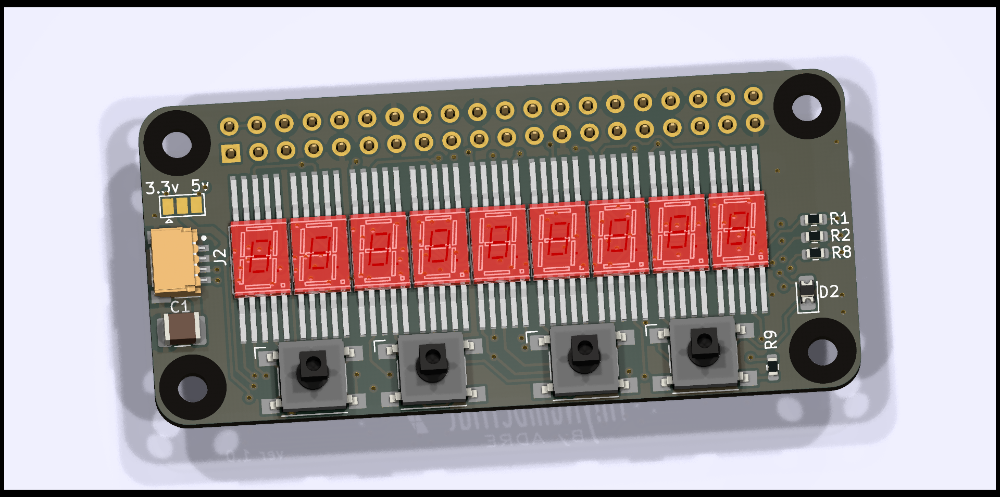
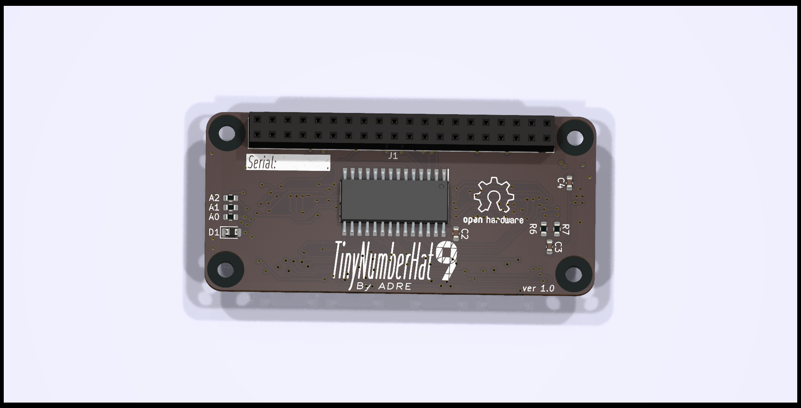
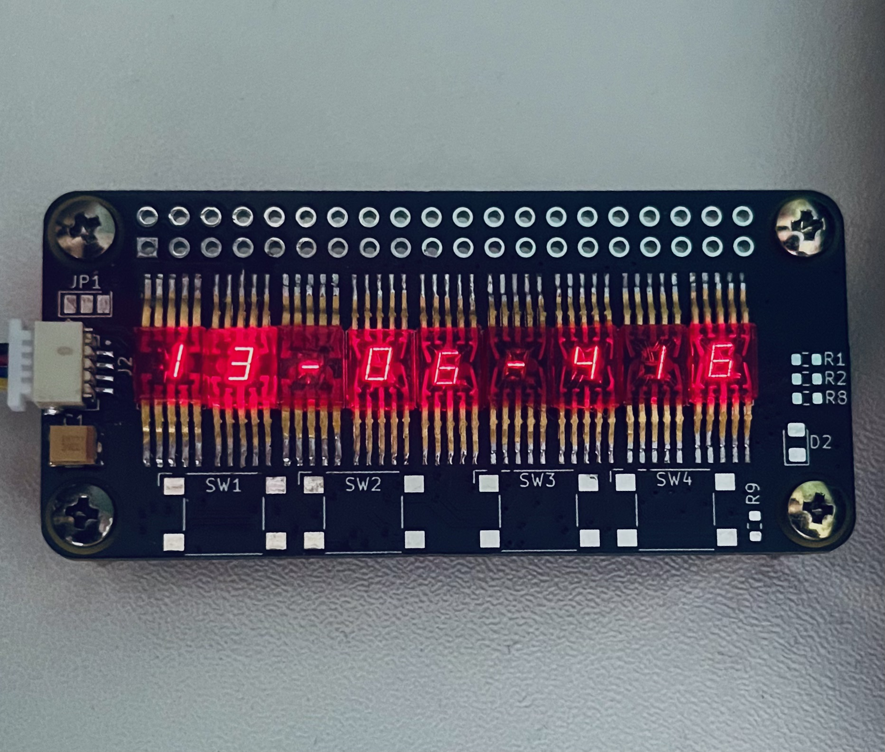
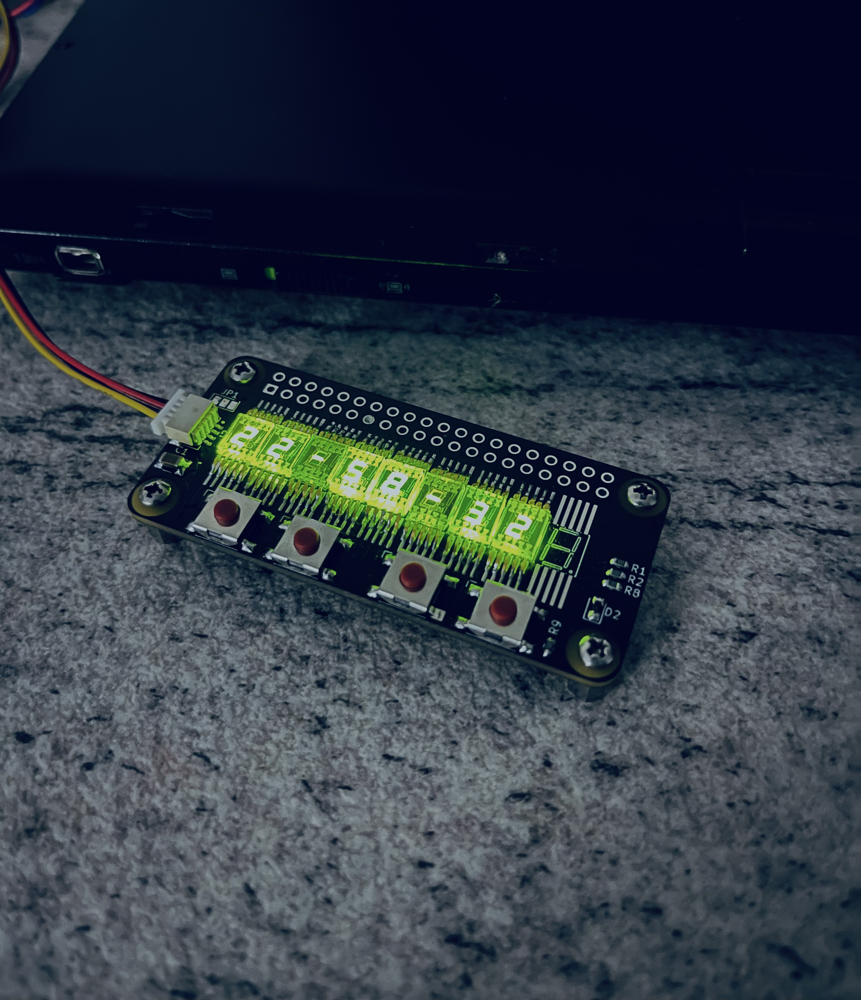
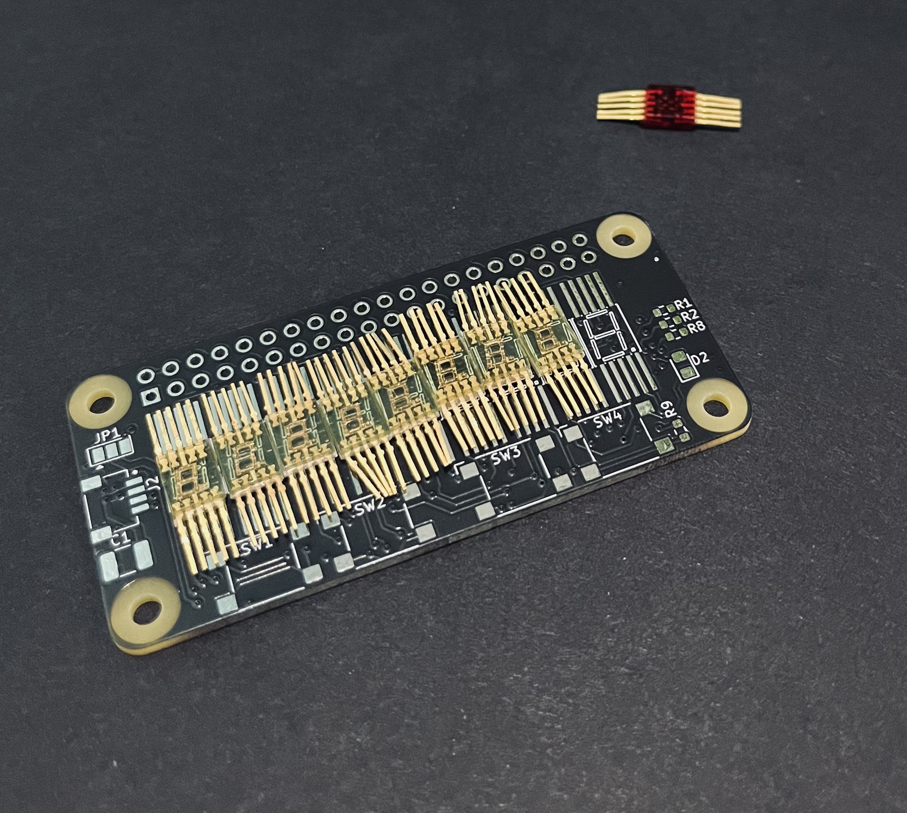
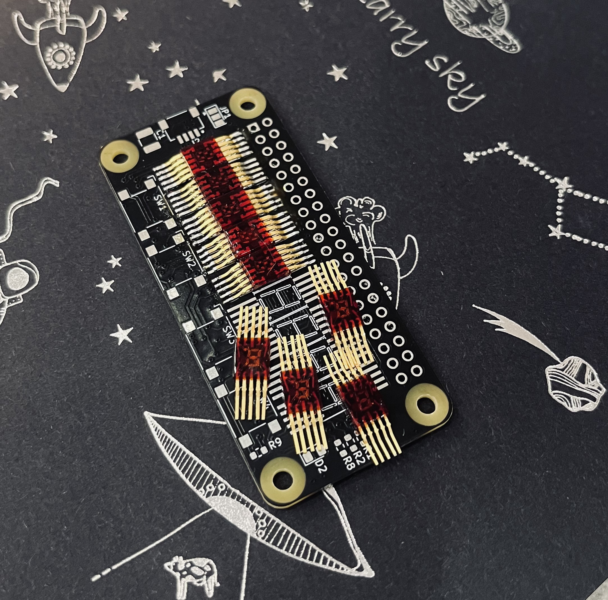
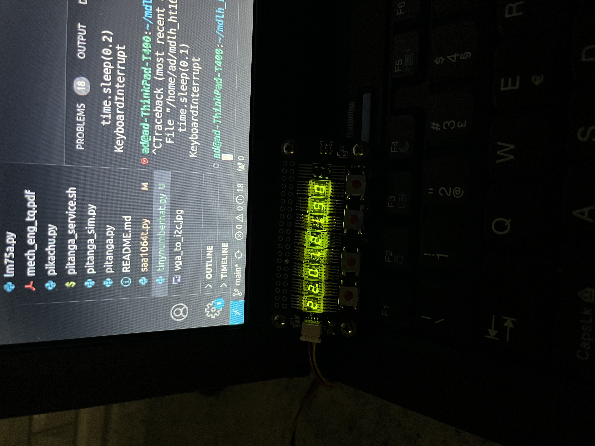

# TinyNumberHat,  time-traveling hardware prodigy 

"Introducing a distinctive open-source hardware project—a compact expansion board centered around the HT16K33 LED driver.

What sets this apart is its integration of niche, obscure, and obsolete displays from the 1970 Cold War era, such as the AL304V, A, or ALS314 display, adding a touch of history to modern technology.

All to enhance user interaction.

<!-- 

  -->
 
Displays, having aged as gracefully as the IP protocol, form a perfect duo to showcase the IP address of your Raspberry Pi ;)
 This gives  a massive advantage in the uproarious game of 'Guess the IP' on your Raspberry Pi :) 

I did that project solely for my own amusement and to spend time doing something enjoyable.
I have definitely enjoyed every minute of it!

    
    

Red ALS314         |  Green AL304V 
:-------------------------:|:-------------------------:
  |  

# Build 

