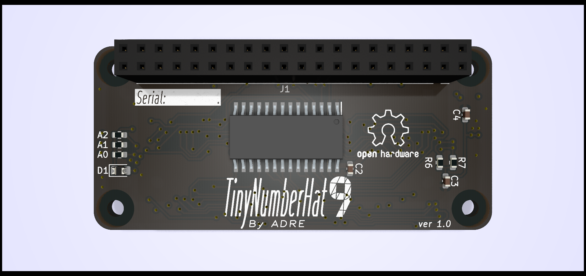

# TinyNumberHat,  time-traveling hardware prodigy 

Introducing a distinctive open-source hardware project—a compact expansion board centered around the HT16K33 LED driver.

What sets this apart is its integration of niche, obscure, and obsolete displays from the 1970 Cold War era, such as the AL304V, A, or ALS314 display, adding a touch of history to modern technology.

All to enhance user interaction.

<!-- 

  -->
 
Displays, having aged as gracefully as the IP protocol, form a perfect duo to showcase the IP address of your Raspberry Pi ;)
 This gives  a massive advantage in the uproarious game of 'Guess the IP' on your Raspberry Pi :) 

I did that project solely for my own amusement and to spend time doing something enjoyable.
I have definitely enjoyed every minute of it!

Red ALS314         |  Green AL304V 
:-------------------------:|:-------------------------:
  |  
                                                | 

Clock example

    
    

<!-- # Build  -->

<!--img src="images/IMG_4520.jpeg" width="400"/-->

# More ideas to explore 

1. **Multi-digit Clock:**
   - Use the 7-segment displays to create a digital clock with hours, minutes, and seconds. You can include features like time formatting and an adjustable clock speed.

2. **Temperature Monitoring:**
   - Interface temperature sensors with each microcontroller to display real-time temperature readings on the 7-segment displays. You can use different colors or flashing patterns to indicate temperature ranges.

3. **Countdown Timer:**
   - Implement a countdown timer with adjustable time settings. This could be useful for various purposes, such as cooking, workout sessions, or other timed activities.

4. **Dice Simulator:**
   - Create a virtual dice game using the 7-segment displays to simulate the roll of multiple dice. It's a fun and interactive way to showcase your project.

5. **Scoreboard for Games:**
   - Design a scoreboard for a simple game, such as a quiz or a two-player game. Each microcontroller can represent a player's score or other relevant game information.

6. **Weather Station:**
   - Connect sensors for humidity, temperature, and pressure to each microcontroller, and display the current weather conditions on the 7-segment displays.

7. **Music Visualizer:**
   - Use audio input or a microphone to capture sound, and represent different aspects of the audio signal on the 7-segment displays. This could include volume levels, frequency bands, or rhythm patterns.

8. **Random Number Generator:**
   - Turn your project into a random number generator. This could be used for games, drawings, or any situation where randomness is needed.

9. **Binary Clock:**
   - Display the current time in binary format using the 7-segment displays. It's a unique and educational way to represent time.

10. **Fitness Tracker:**
    - Interface with sensors like accelerometers or heart rate monitors and display fitness-related metrics, such as step count or heart rate, on the 7-segment displays.

